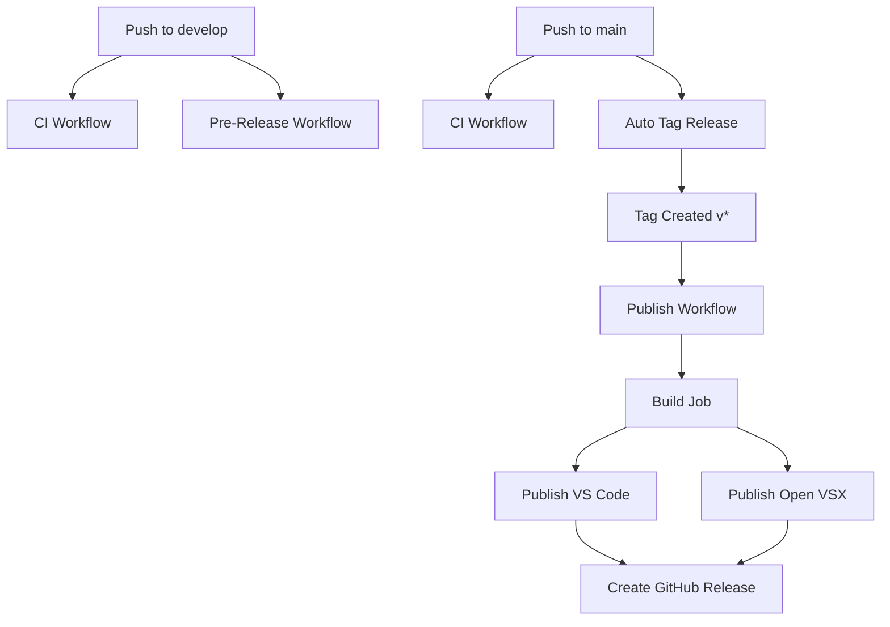

# GitHub Actions Workflows

This document explains the CI/CD workflows for the YAML Key Replace extension.

## Workflows Overview

### 1. CI Workflow (`ci.yml`)

**Trigger:** Push or PR to `main` or `develop` branches

**Purpose:** Continuous Integration - validates code quality on every push

**Steps:**
1. Checkout code
2. Setup Node.js 20.x
3. Install dependencies (`npm ci`)
4. Lint code (`npm run lint`)
5. Compile TypeScript (`npm run compile`)
6. Run tests (if available, continues on error)
7. Package extension (`.vsix`)
8. Upload artifact (retained for 7 days)

**Use Case:** Ensures all code changes pass quality checks before merging

---

### 2. Auto Tag Release (`tag-release.yml`)

**Trigger:** Push to `main` branch

**Purpose:** Automatically creates version tags based on `package.json`

**Steps:**
1. Checkout code with full history
2. Get version from `package.json`
3. Check if tag already exists
4. Create and push tag if it doesn't exist
5. Skip if tag already exists

**Use Case:** Automates tag creation when version is bumped in `package.json`

**Example:**
```bash
# Update version in package.json
npm version patch  # or minor, major

# Commit and push to main
git add package.json
git commit -m "chore: bump version to 0.0.2"
git push origin main

# Workflow automatically creates tag v0.0.2
```

---

### 3. Pre-Release (`pre-release.yml`)

**Trigger:** 
- Push to `develop` branch
- Manual trigger via GitHub Actions UI

**Purpose:** Creates beta/pre-release versions for testing

**Steps:**
1. Checkout code
2. Setup Node.js
3. Install dependencies
4. Compile TypeScript
5. Get version from `package.json`
6. Package extension
7. Create GitHub pre-release with tag `v{version}-beta.{run_number}`

**Use Case:** Test releases before publishing to marketplace

**Example Tag:** `v0.0.1-beta.42`

---

### 4. Publish Extension (`publish.yml`)

**Trigger:** Push of version tags (e.g., `v1.0.0`)

**Purpose:** Publishes extension to VS Code Marketplace and Open VSX Registry

**Jobs:**

#### Build Job
1. Checkout code
2. Setup Node.js
3. Install dependencies
4. Compile TypeScript
5. Extract version from tag
6. Package extension
7. Upload artifact

#### Publish to VS Code Marketplace
1. Download artifact
2. Check if version already published
3. Publish if not already published (or skip)
4. Uses `VSCE_TOKEN` secret

#### Publish to Open VSX Registry
1. Download artifact
2. Check if version already published
3. Publish if not already published (or skip)
4. Uses `VSX_TOKEN` secret

#### Create GitHub Release
1. Checkout code
2. Download artifact
3. Extract changelog for this version
4. Create release notes with installation instructions
5. Create GitHub release with `.vsix` file attached

**Use Case:** Full release pipeline - publishes to both marketplaces and creates GitHub release

---

## Workflow Dependencies



---

## Required Secrets

To use these workflows, you need to configure the following secrets in your GitHub repository:

### 1. `VSCE_TOKEN` (Required for VS Code Marketplace)

**How to get:**
1. Go to https://dev.azure.com/
2. Create a Personal Access Token (PAT)
3. Set organization to "All accessible organizations"
4. Set scope to "Marketplace > Manage"
5. Copy the token
6. Add to GitHub Secrets as `VSCE_TOKEN`

**Documentation:** https://code.visualstudio.com/api/working-with-extensions/publishing-extension

### 2. `VSX_TOKEN` (Required for Open VSX Registry)

**How to get:**
1. Go to https://open-vsx.org/
2. Sign in with GitHub
3. Go to Settings > Access Tokens
4. Create new token
5. Copy the token
6. Add to GitHub Secrets as `VSX_TOKEN`

**Documentation:** https://github.com/eclipse/openvsx/wiki/Publishing-Extensions

### 3. `PAT_TOKEN` (Optional, for tag creation)

**Purpose:** Allows tag-release workflow to trigger publish workflow

**How to get:**
1. Go to GitHub Settings > Developer settings > Personal access tokens
2. Generate new token (classic)
3. Select scopes: `repo` (full control)
4. Copy the token
5. Add to GitHub Secrets as `PAT_TOKEN`

**Note:** If not provided, workflow uses `GITHUB_TOKEN` (which won't trigger other workflows)

---

## Release Process

### Standard Release (to marketplaces)

1. **Update version:**
   ```bash
   npm version patch  # or minor, major
   ```

2. **Update CHANGELOG.md:**
   ```markdown
   ## [0.0.2] - 2026-02-03
   
   ### Added
   - New feature description
   
   ### Fixed
   - Bug fix description
   ```

3. **Commit and push to main:**
   ```bash
   git add package.json CHANGELOG.md
   git commit -m "chore: release v0.0.2"
   git push origin main
   ```

4. **Workflow automatically:**
   - Creates tag `v0.0.2`
   - Publishes to VS Code Marketplace
   - Publishes to Open VSX Registry
   - Creates GitHub Release with changelog

### Pre-Release (for testing)

1. **Push to develop branch:**
   ```bash
   git push origin develop
   ```

2. **Or manually trigger:**
   - Go to GitHub Actions
   - Select "Pre-Release" workflow
   - Click "Run workflow"

3. **Result:**
   - Creates pre-release with tag like `v0.0.1-beta.42`
   - Attaches `.vsix` file
   - Does NOT publish to marketplaces

---

## Monitoring Workflows

### View Workflow Runs
- Go to your repository on GitHub
- Click "Actions" tab
- See all workflow runs and their status

### Debugging Failed Workflows
1. Click on the failed workflow run
2. Click on the failed job
3. Expand the failed step
4. Read error messages
5. Common issues:
   - Missing secrets (`VSCE_TOKEN`, `VSX_TOKEN`)
   - Version already published
   - Compilation errors
   - Network timeouts

### Badges

Add these badges to your README.md:

```markdown
[](https://github.com/lucasbiel7/yaml-key-replace/actions/workflows/ci.yml)
[](https://github.com/lucasbiel7/yaml-key-replace/actions/workflows/publish.yml)
```

---

## Troubleshooting

### Tag Already Exists
**Problem:** Workflow skips tag creation because tag already exists

**Solution:** 
- Delete the tag: `git tag -d v0.0.1 && git push origin :refs/tags/v0.0.1`
- Or bump version in package.json

### Version Already Published
**Problem:** Marketplace already has this version

**Solution:**
- Workflows automatically skip publication
- Bump version in package.json for new release

### Workflow Not Triggering
**Problem:** Tag created but publish workflow doesn't run

**Solution:**
- Use `PAT_TOKEN` secret instead of `GITHUB_TOKEN`
- Or manually create tag: `git tag v0.0.1 && git push origin v0.0.1`

---

## Best Practices

1. **Always update CHANGELOG.md** before releasing
2. **Test with pre-releases** before publishing to marketplace
3. **Use semantic versioning** (major.minor.patch)
4. **Keep secrets secure** - never commit them
5. **Monitor workflow runs** to catch issues early
6. **Use descriptive commit messages** for better release notes
